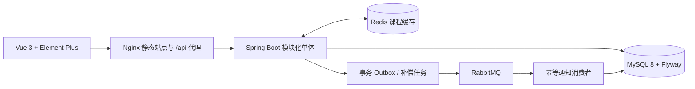
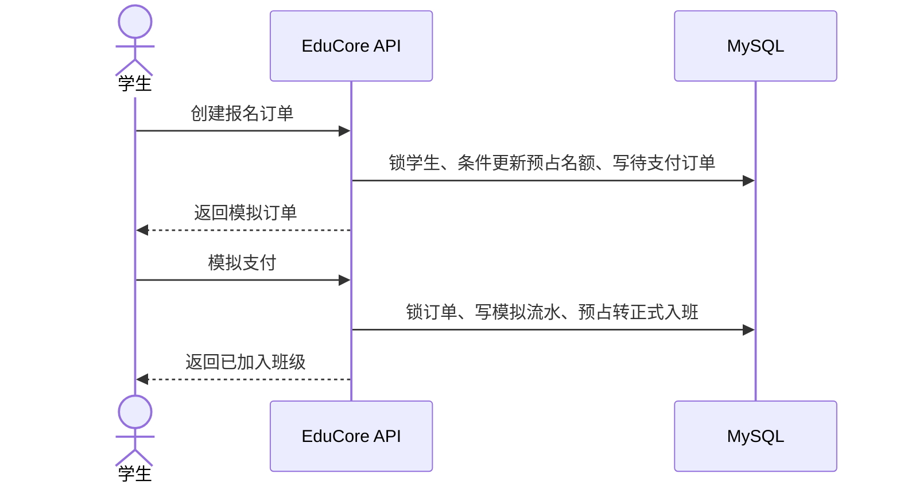
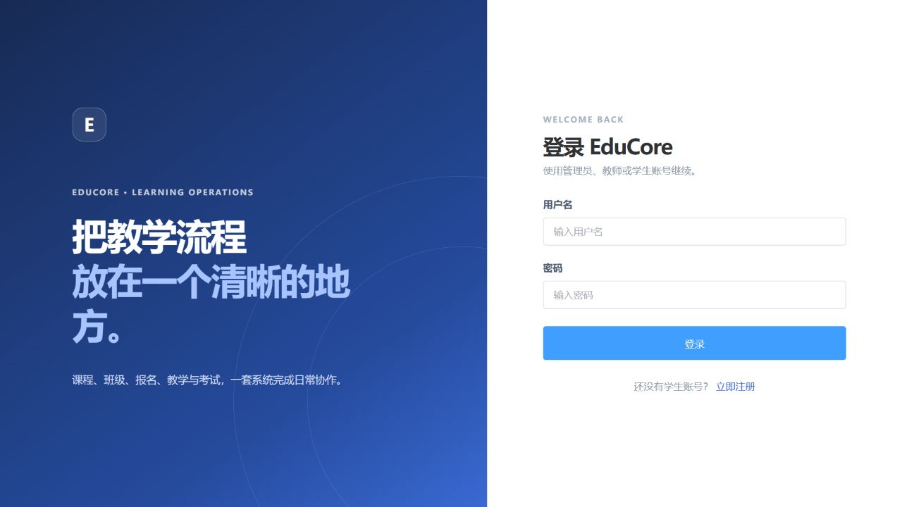
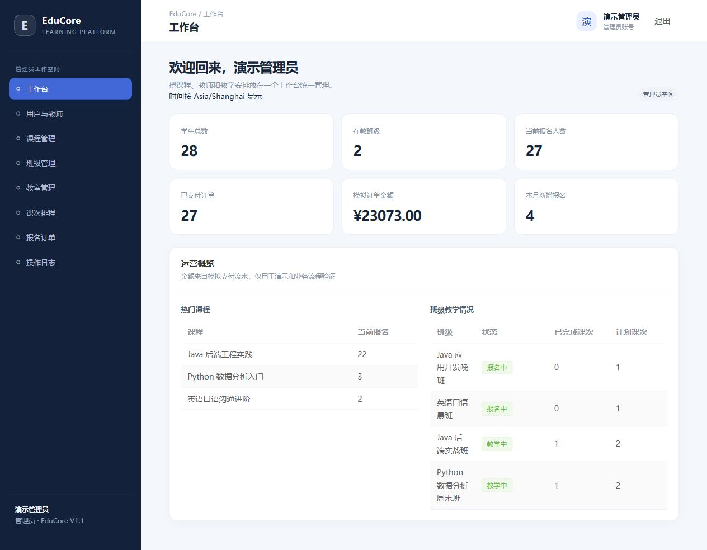
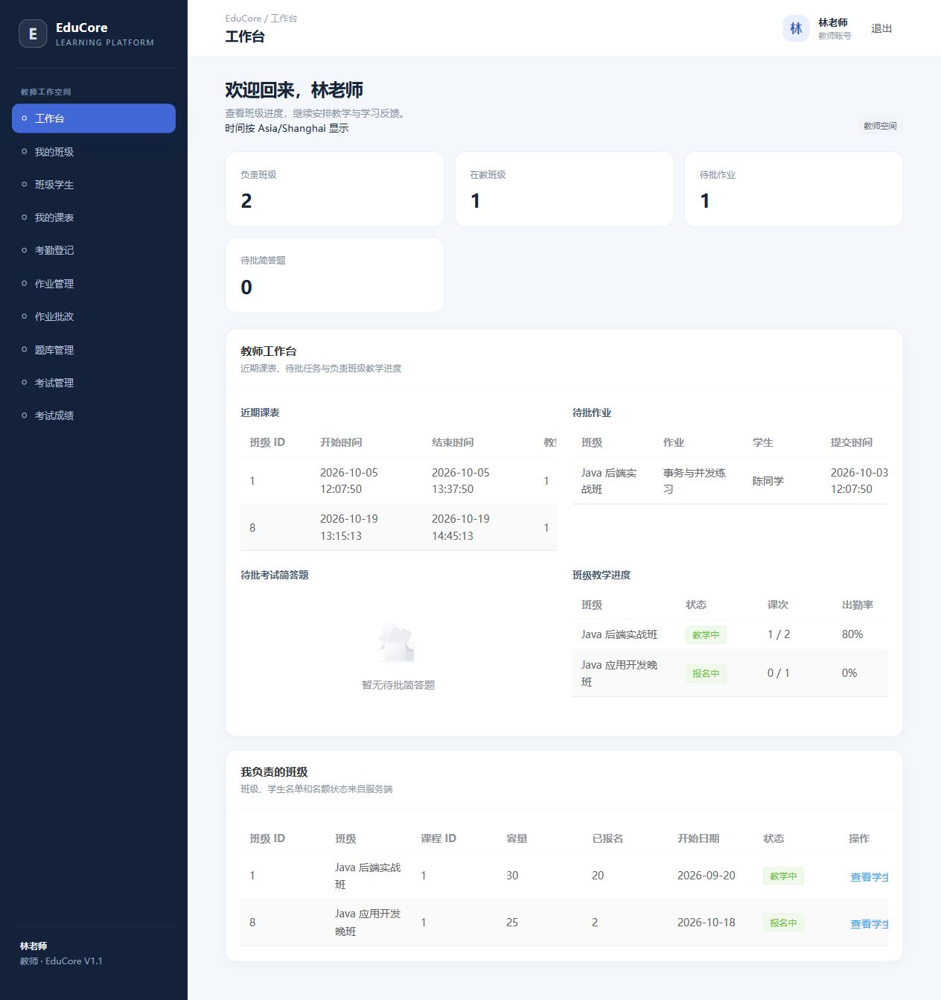
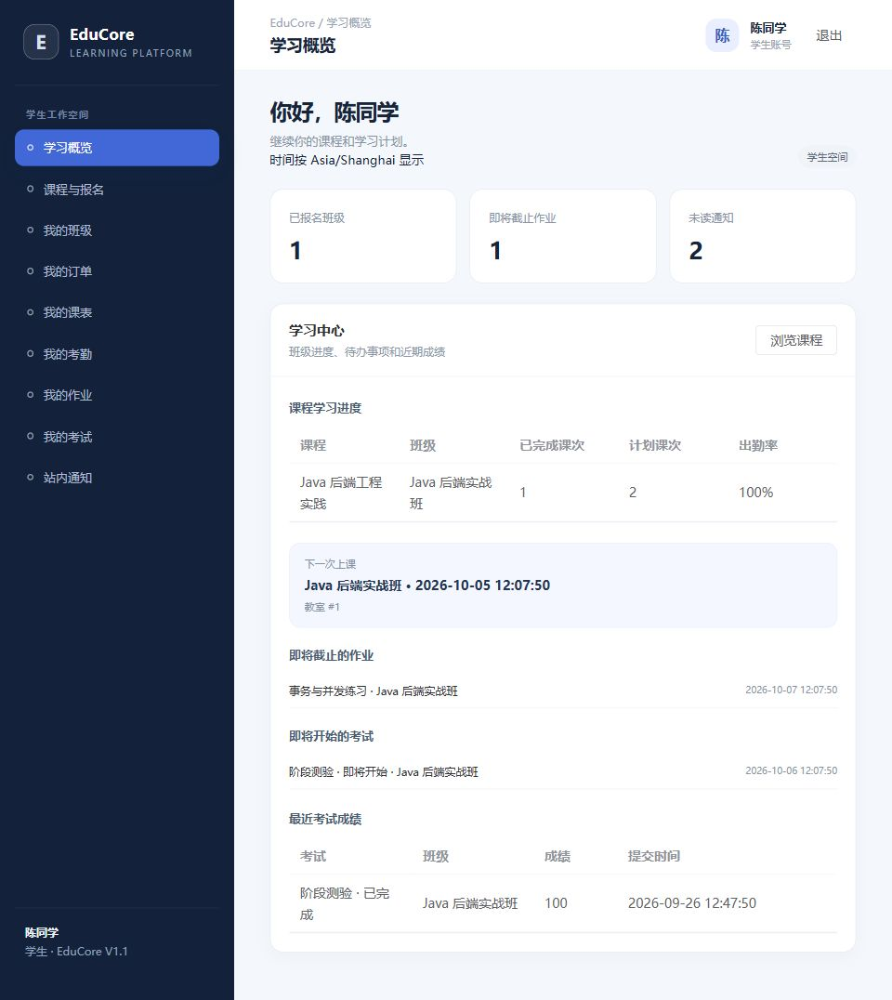
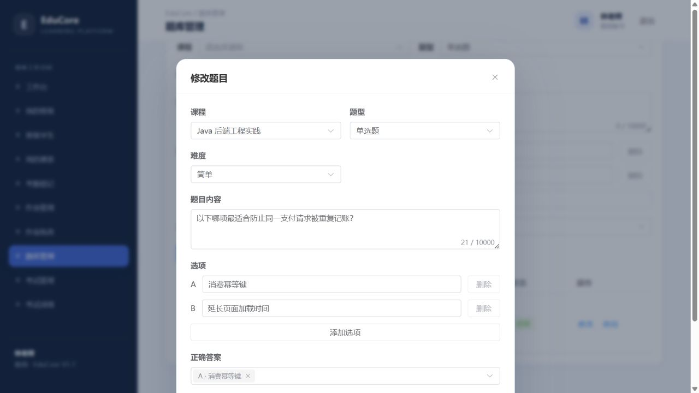

# EduCore 教培管理平台 V1.1

EduCore 是面向培训机构日常教学流程的模块化单体项目，覆盖账号权限、课程班级、排课、报名与模拟支付、考勤、作业、题库考试、成绩分析和三类角色工作台。系统使用 Java 21、Spring Boot 3、MyBatis-Plus、MySQL、Redis、RabbitMQ，以及 Vue 3、TypeScript、Element Plus。

所有业务 API 使用 `/api` 前缀。订单金额及支付页面均为**模拟数据**，没有真实收款能力。

## 在线体验

[打开演示系统](http://114.55.232.26)。管理员、教师、学生体验账号分别为 `admin`、`teacher`、`student`，公网实例的密码由项目维护者单独提供。下文的示例密码只用于本地初始化数据。

## 项目概览

| 角色 | 核心工作流 |
| --- | --- |
| 管理员 | 用户与教师、课程、教学班、教室、排课、订单、运营看板与班级教学分析 |
| 教师 | 班级和学生、工作台课表与待办、考勤确认、作业发布和批改、题库、考试组卷和成绩分析 |
| 学生 | 课程报名、模拟支付、学习进度、课表考勤、作业提交、在线考试、成绩和通知 |

管理员运营看板统计学生数、在教班级、当前报名、已支付模拟订单、模拟金额、本月报名、热门课程和班级进度。教师工作台聚合近期课表、待批作业、待批简答题及本人班级教学进度。学生看板聚合在读班级、课时进度、下一次课程、近期作业和考试、最近成绩及未读通知。教师确认课次并完成逐人考勤后，管理员还需关闭作业/考试并处理待批成绩，班级才能结课。

## 技术栈

- Java 21、Spring Boot 3.5、Spring Security、JWT、Bean Validation
- MyBatis-Plus、MySQL 8、Flyway、HikariCP
- Redis 课程详情缓存
- RabbitMQ、事务 Outbox、publisher confirm、消费幂等与数据库补偿
- Vue 3、TypeScript、Vite、Pinia、Element Plus
- JUnit 5、Mockito、Spring Boot Test、H2
- Docker Compose 容器部署；默认 Dockerfile 使用本地构建的 JAR 和前端静态文件

## 系统架构



后端按业务模块组织，每个模块就近放置 `controller`、`service` 和 `mapper`；模型集中在模块的 `entity` 包，DTO、VO、枚举放在 `entity.dto`、`entity.vo`、`entity.enums` 子包。MyBatis-Plus `BaseMapper`、条件构造器和分页处理常规 CRUD，多表聚合、行锁和条件原子更新保留定制 SQL。MySQL 保存业务事实；Redis 不参与名额或权限判断。订单消息和作业通知先与业务数据一起写入 Outbox，再由 publisher confirm 发布。MQ 消费者使用消费日志和通知唯一键去重；订单过期及通知遗漏都有数据库扫描补偿。

## 核心业务流程

### 报名与模拟支付



订单创建、支付、取消和超时释放在事务中维护订单状态和班级容量。学生重复报名串行化，订单终态只调整一次计数；Redis 缓存不参与报名判断。

### 教学结课

教师为完成的课次登记每位正式成员的考勤，再调用 `POST /api/teacher/schedules/{id}/complete`。结课操作检查教师归属、课次结束时间和考勤完整性。班级转换为 `FINISHED` 前还需确认课程日期已结束、至少存在一节课次、没有未完成课次或缺失考勤，并关闭已发布作业/考试、处理所有已提交作业和简答题。

## 数据库设计

Flyway 迁移位于 [`src/main/resources/db/migration`](src/main/resources/db/migration)：

| 版本 | 主要数据 |
| --- | --- |
| V1 | 用户、角色和账号状态 |
| V2 | 课程、班级、教室和课次 |
| V3 | 班级成员、订单、模拟支付、消息 Outbox 和消费日志 |
| V4 | 考勤、作业、提交和通知 |
| V5 | 题库、试卷快照、考试尝试和答案 |
| V6 | 课次 `COMPLETED` 状态，支持教师确认课次和结课校验 |
| V7 | 业务操作审计及 Redis 课程缓存失效补偿 |

关键唯一键包括 `(class_id, student_id)`、订单号、支付的 `order_id`、`(schedule_id, student_id)`、`(assignment_id, student_id)`、`(exam_id, student_id)` 和 `(consumer_name, event_id)`。完整表说明见 [数据库设计](docs/database.md)。

## 关键技术实现

- **报名并发**：学生行锁串行重复请求；带容量条件的原子 `UPDATE` 预占名额；支付与释放先锁订单并以订单状态迁移作为幂等边界。
- **支付与超时互斥**：两条路径均锁定订单并使用 UTC 到期判断，只允许 `PENDING` 第一次迁移。
- **排课并发**：教师、教室、班级按固定顺序锁资源行；锁内再次检查教师、教室和班级时间冲突。
- **消息可靠性**：事务 Outbox、确认后标记发送、重试租约；消费者日志和业务唯一键保证重复消息安全；作业通知另有缺失数据恢复任务。
- **缓存一致性**：只缓存课程详情；事务提交后立即清理并持久化失效任务作补偿，报名名额不读写缓存。
- **考试草稿**：复用 `exam_answer` 唯一键暂存本人答题，恢复时只返回本人进行中尝试的答案；提交与超时收卷按已保存答案评分。
- **操作审计**：记录已认证写请求的操作者、接口、结果和 requestId，不保存请求体、密码、JWT 或作答内容。
- **数据权限**：教师查询和写操作按当前 JWT 主体校验班级及课次归属；学生订单、通知、提交、考试和考勤限定当前用户。
- **考试**：发布时冻结题面与答案快照，客观题自动评分；主观题按答卷锁串行批改，完成后才发布最终成绩。
- **聚合分析**：看板及班级分析直接使用 MySQL 聚合查询，不增设分析中间件。
- **前端加载**：Element Plus 组件按需导入，登录、注册和已登录工作台按路由拆包。

## 本地启动

需要 JDK 21、Maven 3.9+、Node.js 24+、MySQL 8、Redis 7 和 RabbitMQ 4。Spring Boot 不会自动读取 `.env`；复制 `.env.example` 后，需要将变量注入启动 shell 或 IDE。

```powershell
# 根目录：设置当前 shell 的本机开发变量
$env:DB_URL = 'jdbc:mysql://localhost:3306/educore?useUnicode=true&characterEncoding=utf8&serverTimezone=UTC'
$env:DB_USERNAME = 'educore'
$env:DB_PASSWORD = '本机数据库密码'
$env:JWT_SECRET = '请使用至少 32 字节的随机秘密'
$env:ADMIN_USERNAME = 'demo-admin'
$env:ADMIN_PASSWORD = 'LocalDemo2026!'
$env:REDIS_HOST = 'localhost'
$env:RABBITMQ_HOST = 'localhost'
mvn spring-boot:run
```

后端首次启动由 Flyway 执行 V1–V7。前端另开终端：

```powershell
cd web
npm ci
npm run dev
```

打开 `http://localhost:5173`；开发代理将 `/api` 转发到 `http://localhost:8080`。OpenAPI 页面为 `http://localhost:8080/swagger-ui.html`。

## Docker Compose 部署与演示数据

Docker Compose 配置包含 MySQL、Redis、RabbitMQ、Spring Boot API 和 Nginx 前端。先在项目目录构建 JAR 和前端静态文件，再把项目与 `target/educore-*.jar`、`web/dist` 一起部署；运行镜像不会在服务器上重复下载 Maven/npm 依赖。

```powershell
Copy-Item .env.example .env
# 如需共享或暴露端口，请先替换 .env 中所有 local_demo 密码和 JWT_SECRET。
mvn -q verify
Push-Location web; npm ci; npm run build; Pop-Location
docker compose up --build -d
./scripts/load-demo-data.ps1
```

若要在 Docker 构建阶段从源码编译，可分别指定 `Dockerfile.source` 和 `web/Dockerfile.source`。

本地打开 `http://localhost`。当前云端临时演示实例为 [http://114.55.232.26](http://114.55.232.26)（HTTP）；Nginx 将 `/api` 代理到后端，数据库和中间件端口只绑定服务器回环地址。MySQL、Redis 和 RabbitMQ 数据写入独立 named volume。常用运维命令：

```powershell
docker compose ps
docker compose logs -f backend
docker compose down
```

本地初始化脚本包含常规账号（1 个管理员、3 个教师、28 个学生）和角色快捷账号（`admin`、`teacher`、`student`），示例密码统一为 `LocalDemo2026!`。可用下列常规账号切换角色；学生账号 `demo-student-02` 至 `demo-student-28` 均已创建：

| 角色 | 用户名 | 密码 |
| --- | --- | --- |
| 管理员 | `demo-admin` | `LocalDemo2026!` |
| 教师 | `demo-teacher`、`demo-teacher-02`、`demo-teacher-03` | `LocalDemo2026!` |
| 学生 | `demo-student`、`demo-student-02` … `demo-student-28` | `LocalDemo2026!` |

本地种子数据包含 Java、Python 和英语课程，进行中与开放报名班级，已支付、待支付和已取消订单，以及多名学生的考勤、作业提交与考试成绩。Java 实战班容量为 30 人，种子数据有 20 人正式入班，保留 10 个名额供体验报名；可用 `demo-student-07` 查看待支付订单、`demo-student-08` 查看 Python 班级和已批作业、`demo-student-10` 查看待批作业；教师 `demo-teacher-02` 管理 Python 班，`demo-teacher-03` 管理英语班。账号、课程、教学班和教室管理列表按数据库 ID 升序展示。ID 是数据库关联主键，失败回滚或删除后不会自动补号，因此 ID 间有间隔不代表缺少业务记录。初始化文件为 [`scripts/init-demo.sql`](scripts/init-demo.sql)、[`scripts/extend-demo.sql`](scripts/extend-demo.sql) 和 [`scripts/simple-showcase-accounts.sql`](scripts/simple-showcase-accounts.sql)；加载脚本可重复执行。所有账号和数据均为虚构演示内容，本地示例密码不能用于对外部署。

快捷账号关联了 Java 后端工程实践课程下的“快捷账号体验班”、一间专用教室、一条未来课次、一个学生报名和一份待批改作业。加载演示数据后，这些账号能直接展示管理员、教师和学生工作台；管理员账号可以修改演示数据。

## 界面截图

以下截图于 2026-10-04 从云端实际运行页面采集，使用关联的演示业务数据。业务时间按浏览器所在时区显示；此处为 Asia/Shanghai。

<details><summary>登录页面</summary>



</details>

<details><summary>管理员运营首页</summary>



</details>

<details><summary>教师工作台</summary>



</details>

<details><summary>学生学习中心</summary>



</details>

<details><summary>题库编辑表单</summary>



</details>

云端 [Swagger UI](http://114.55.232.26/swagger-ui.html) 与 [OpenAPI JSON](http://114.55.232.26/v3/api-docs) 已经通过 Nginx 代理到后端，业务接口仍使用 `/api` 前缀。

## 自动化测试与实际结果

2026-10-06 的公网展示检查记录见 [HR 展示检查](docs/hr-ready-check-2026-10-06.md)：三角色登录和 43 项低频接口检查通过，补齐了开放报名班级与可独立体验的考试。2026-10-05 的源码修复及验收见 [最后审查记录](docs/final-review-2026-10-05.md)。以下测试数量为 2026-10-04 的历史执行结果。

```powershell
# 根目录
mvn -q verify

# web 目录（Node.js 24）
npm test
npm run build
```

最新实际验证结果、云端容器测试、数据库迁移和未覆盖项见 [测试报告](docs/test-report.md)。历史 V1.0 的 Redis/RabbitMQ 联调及报名容量压测单独标注，不当作本版本回归结果。

2026-10-04 展示修复后执行 `mvn clean verify -q`：**34 个后端测试全部通过、6 个套件**，包含非百分制试卷及格率的新回归；前端 `npm test` 的 **3 个测试全部通过**，类型检查和生产构建成功。当前包结构和展示修复已一起部署到云端 Docker。云端 MySQL 8.4 容器中使用会话临时表复验实际 Mapper 及格率 SQL：50/100 分试卷边界正确，待批成绩不计入最终及格率。三角色实际登录与工作台截图、题库编辑回显及保存已经浏览器验证，Swagger 返回真实页面，OpenAPI 返回 JSON（69 条路径）。本次没有执行完整浏览器端到端套件、真实 MySQL 高并发或 Redis/MQ 故障恢复测试。历史 37 个测试的记录来自旧包名报告重复计数，已更正。问题发现和修复记录见 [展示审查](docs/showcase-review-2026-10-04.md)。

同日补齐 requestId 日志关联后，最新 `mvn clean verify -q` 为 **37 个后端测试全部通过**（原 34 个加 3 个日志测试）。云端已实际验证错误响应、MySQL 操作审计和 Docker 日志使用同一个编号；未知异常堆栈分支通过本地测试。使用方法见 [requestId 排查步骤](docs/deployment.md#使用-requestid-排查请求)。

2026-10-04 随后完成云端全接口路由联调：OpenAPI 的 76 个操作均已请求，5 个跨角色检查均正确拒绝；修复参数校验 500 后重新部署。最新 `mvn verify -q` 共 **38 项测试全部通过**。成功业务写入的云端 MySQL 全流程未在本轮执行，细节与限制见 [云端接口联调记录](docs/api-e2e-report-2026-10-04.md)。

## 3–5 分钟项目演示脚本

逐分钟流程和推荐讲解点见 [项目演示脚本](docs/demo-script.md)。建议顺序：管理员看运营数据并创建班级，学生创建订单并完成模拟支付，教师检查名单并登记/确认考勤，再浏览作业与考试成绩分析。

## 文档入口

- [HR 展示检查（2026-10-06）](docs/hr-ready-check-2026-10-06.md)
- [最后审查与修复（2026-10-05）](docs/final-review-2026-10-05.md)
- [API 接口与权限](docs/api.md)
- [架构与消息流](docs/architecture.md)
- [业务规则](docs/business-rules.md)
- [数据库结构与迁移](docs/database.md)
- [并发和一致性设计](docs/concurrency.md)
- [部署说明](docs/deployment.md)
- [测试与验收报告](docs/test-report.md)
- [云端全接口联调记录](docs/api-e2e-report-2026-10-04.md)
- [V1.1 源码审查与交付记录](docs/v1.1-review.md)
- [报名容量压力测试计划](performance/README.md)
